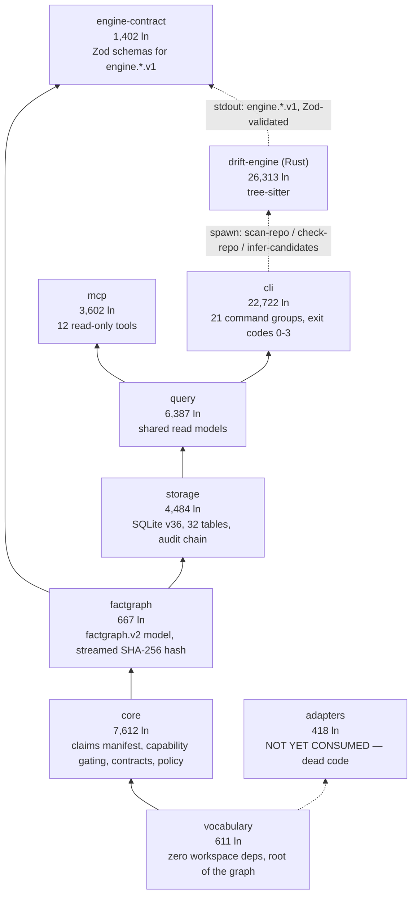
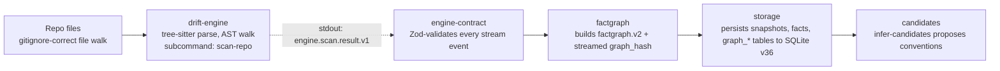
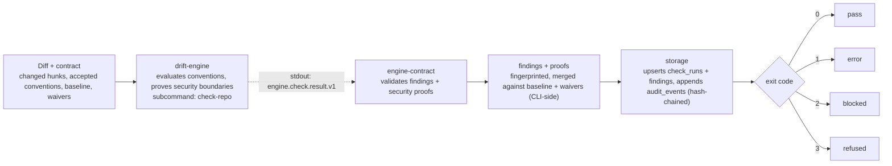
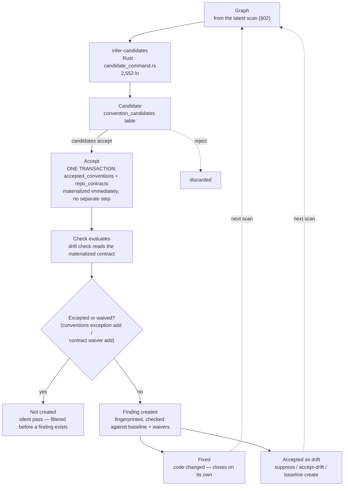
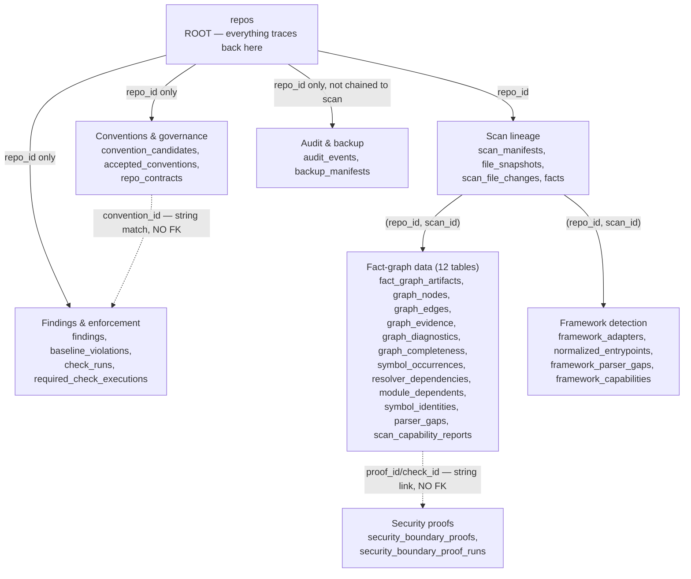
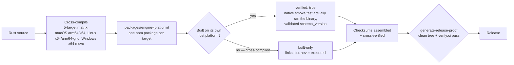
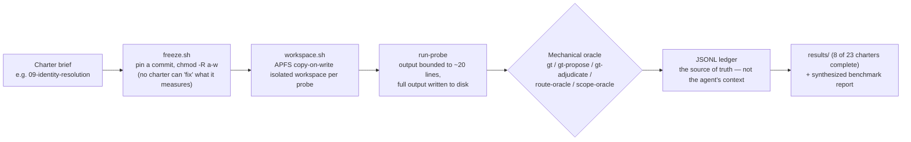

# Drift Architecture Map

A structural reference for the Drift codebase, traced from source (not from prior docs) as of commit `a0517f3e`, 2026-08-19. Intended as context for agents working in this repo — every claim below cites the file/module it came from so it can be re-verified against current code.

**At a glance:** ~74.2k lines across 9 packages/crates · fact graph schema `factgraph.v2` · storage schema `v36` (32 domain tables) · 12 read-only MCP tools · 21 CLI command groups.

**TL;DR:** A Rust tree-sitter engine builds a versioned fact graph from a TS/JS repo; an audited SQLite store persists it; matched CLI and MCP surfaces read it back. Conventions are inferred from the graph, accepted by a human or agent, and enforced on every future check — a violation can then be fixed, waived, or baselined, each with a different durability. About a third of the Rust engine exists just to prove security boundaries (auth, SSRF, CSRF, and more) at three independently verified trust tiers. Two separate infrastructures exist to keep those claims honest: a CI-wired eval suite with adversarial fixtures, and a 23-charter agent-orchestrated QA program that audits the whole system against real repos. Known gaps, stubs, and doc inaccuracies are tracked candidly in [§15](#15-engineering-notes) rather than smoothed over.

## Contents

1. [System architecture](#01-system-architecture)
2. [Runtime flow — scan](#02-runtime-flow--drift-scan)
3. [Runtime flow — check](#03-runtime-flow--drift-check)
4. [Convention lifecycle](#04-convention-lifecycle)
5. [Security boundary proofs](#05-security-boundary-proofs)
6. [Framework coverage](#06-framework-coverage)
7. [Agent governance surface](#07-agent-governance-surface)
8. [Layer reference](#08-layer-reference)
9. [Storage schema](#09-storage-schema)
10. [CLI command reference](#10-cli-command-reference)
11. [Surface parity — CLI ↔ MCP](#11-surface-parity--cli--mcp)
12. [Release & distribution pipeline](#12-release--distribution-pipeline)
13. [CI verification & ground truth](#13-ci-verification--ground-truth)
14. [Beta live-validation program](#14-beta-live-validation-program)
15. [Engineering notes](#15-engineering-notes)

---

## 01. System architecture

Nine build units, laid down like strata. Each layer imports only from the layers beneath it — `vocabulary` at the foundation defines every shared enum; `cli` and `mcp` at the surface are the only two things a human or agent ever talks to. The Rust engine sits outside this stack entirely: it's a separate binary, invoked as a subprocess, not a compiled dependency.



Only adjacent-layer imports are drawn. `query` also imports `factgraph` and `core` directly; `storage`/`engine-contract` both also import `core`. Full build order:

```
vocabulary → core → {factgraph, adapters} → {engine-contract, storage} → query → {cli, mcp}
```

`adapters` is defined but not imported by any package in the current dependency graph (see [§06](#06-framework-coverage) and [§15](#15-engineering-notes)).

**`vocabulary` is a generated output, not a hand-authored source of truth.** Both `crates/drift-engine/src/vocabulary.rs` *and* `packages/vocabulary/src/index.ts` are generated from one manifest, `vocabulary/vocabulary.json`, by `vocabulary/generate.mjs` — neither side generates the other. `scripts/vocabulary-parity.mjs` catches staleness in CI.

**Drift enforces its own architecture against itself.** The repo root's `drift.lock` is Drift's own live `repo_contract`, including an `agent_contracts` rule forbidding the `mcp` module from importing `@drift/cli` — the exact dependency-stack rule this section asserts, here mechanically self-enforced rather than just documented (`test/e2e/dogfood-enforcement-proof.test.ts`, `rd-architecture-drift.test.ts`).

---

## 02. Runtime flow — `drift scan`

Every scan is one subprocess call out and a chain of typed hand-offs back: the Rust engine never touches SQLite, and the CLI never parses source — each side does exactly one job.



The engine → engine-contract hop is the one process boundary in the pipeline (dashed above): everything else is an in-process TypeScript call. A malformed or unrecognized field at that boundary is a hard parse failure by design, not a silent pass-through.

---

## 03. Runtime flow — `drift check`

A second, independent engine invocation evaluates the accepted contract against the graph, and every run — pass or fail — is appended to a tamper-evident audit chain before the exit code is decided.



Refusal (exit 3) fires when the graph is incomplete or the engine times out — Drift would rather refuse to judge than pass a repo it couldn't actually see.

**Audit chain:** `audit_events` rows are hash-linked — each row's `before_hash` equals the prior row's `after_hash`. This is enforced entirely in application code (`sqlite-storage.ts`); there is no SQL constraint backing it (see [§09](#09-storage-schema)).

### Diff / scope computation

| Scope (`--scope`) | What it examines | Compared against |
|---|---|---|
| `changed-hunks` (default) | Line-level: a finding is `new_in_diff` only if it falls inside an added `@@` hunk range | `--diff <range>` (runs `git diff --unified=0 <range>`) or `--diff-file <path>` — never an implicit comparison |
| `changed-files` | File-level: every line in a touched file is in scope, regardless of which lines actually changed | same as above |
| `full` | The whole indexable file tree, no diff needed | n/a |

Diff scope and the `baseline` from [§04](#04-convention-lifecycle) are different concepts: scope decides which lines are even examined this run; baseline decides whether an already-known violation on an examined line still blocks.

A different, unrelated "scope" question shares the name: **"which files does this convention cover" has one canonical answer.** `packages/core/src/convention-scope.ts` is the single shared implementation used by `check`, CLI packets, and MCP packets. It exists because a second, independent scope implementation in the CLI once silently disabled enforcement for the default `create-next-app` layout while still reporting `can_block: true` — a false-pass a caller had no way to detect from the response alone.

---

## 04. Convention lifecycle

This is the loop the product is named after. A pattern is proposed, a human or agent accepts it, every future check enforces it — and when a violation surfaces, a team has exactly three ways to live with it, each with a different strength.



The exception/waiver gate sits **before** a finding is created (a silent, permanent pass). Suppress, accept-drift, and baseline all act **after** one exists, and only baseline is time-limited.

| Mechanism | CLI command | Prevents finding? | Durability |
|---|---|---|---|
| Exception | `conventions exception add` | Yes — gates before creation | Permanent, contract-level |
| Waiver | `contract waiver add` | Yes — same silent-pass gate | Permanent, contract-level |
| Suppress | `findings suppress` | No — created, then closed | Permanent, survives any diff |
| Accept drift | `findings accept-drift` | No | Permanent, survives any diff |
| Baseline | `baseline create` | No | **Weakest** — voided if the flagged line changes |

---

## 05. Security boundary proofs

Six modules, roughly 9,060 lines — about a third of the entire Rust engine — exist to answer one question per convention: does this call actually resolve to the accepted helper, or just look like it does? Internal docs (`security-identity-resolution-review.md`) describe this as "five" resolution tiers; tracing the code itself finds **three verified ones**.

| Tier | Strength | What it does | Where |
|---|---|---|---|
| **Tier 2** | Strongest | Resolved module identity — walks live `ImportResolvesToModule` graph edges. The only graph-truth resolver. Must run in the *binary* crate: the graph types it needs (`protocol.rs`) aren't visible to library modules. | `graph_direct_data_access_findings` · `check_command.rs` |
| **Tier 1** | Partial | Name + import-source match — matches the import specifier string; in its strongest mode also reconciles aliases/relative paths against the contract's file list. Code comment: *"Tier 1, honestly."* | `accepted_phase4_auth_helper_for_call`, `accepted_authorization_helper_for_call` · `security_patterns.rs` |
| **Tier 0** | Fallback of last resort | Name-only match — matches only the imported symbol's *name*, not where it came from. Any re-export or wrapper sharing that name satisfies it. This is an **evasion risk, not a false-positive one**: every security convention except one relies on Tier 0 or Tier 1. | `accepted_auth_helper_for_call` · `security_patterns.rs` |

**What a proof covers:** `auth`, `middleware`, `request_validation`, `ssrf`, `raw_sql`, `cors`, `csrf`, `rate_limit`, `response_shape`, `sinks`, `session_trust`, `authorization`, `tenant` (from `EngineSecurityBoundaryProofSchema` in `engine-contract`).

**Where the code lives (line counts):**

| Module | Lines |
|---|---|
| `security_proof.rs` | 2,309 |
| `security_facts.rs` | 2,277 |
| `security_phase6.rs` | 1,390 |
| `security_patterns.rs` | 1,278 |
| `security_rules.rs` | 991 |
| `security_control_flow.rs` | 816 |

**A TS-side mirror exists too, and it has its own history of drifting.** `packages/core/src/security.ts` (764 ln) mirrors the security-capability-name and finding-reason-code vocabularies on the TypeScript side, separate from the Rust `security_*.rs` modules above. An in-code comment documents the two sides once diverging — 20 capability names declared vs. 13 the engine actually reported, and 32 duplicated reason codes — now closed by a parity gate.

---

## 06. Framework coverage

The wire schema (`FrameworkNameSchema`) lists eleven frameworks. One of them has an adapter behind it.

| Framework | Status | Evidence |
|---|---|---|
| Next.js — App Router | **Implemented** | `frameworks/mod.rs` — `endpoint_shape()`, wired into the scan |
| Next.js — Pages Router | **Implemented** | same function, `next_pages_api` branch |
| Express | Stub, dead code | `packages/adapters/src/index.ts:232` — factory function, zero dependents package-wide |
| Fastify · Nest · Hono · Remix · tRPC · GraphQL · Lambda · worker | Stub, enum only | `core/frameworks.ts` `FrameworkNameSchema` — no adapter logic anywhere |

The `adapters` package flagged in [§01](#01-system-architecture) as defined-but-unconsumed is exactly this: Express's factory function lives there, and the file's own comment admits the package has zero dependents.

---

## 07. Agent governance surface

How Drift decides what an AI agent may see or do before it touches code. Some of this is real enforcement; one piece is a ledger nobody reads.

**"Capability" means two unrelated things**, and both gate real behavior:

- **`EnforcementCapability`** (`core/src/domain.ts`) — three values: `briefing_only`, `heuristic_check`, `deterministic_check`, attached to each convention. Governs whether it can ever *block*: `--mode block` is refused outright unless a convention is `deterministic_check`.
- **`SemanticCapabilityContract`** (`core/src/semantic-capabilities.ts`) — eight certified facts the engine can prove: `file_discovery`, `syntax_facts`, `static_imports`, `import_resolution`, `route_flow`, `dynamic_imports`, `computed_calls`, `data_operation_detection`. A rule needing one that isn't certified forces the whole readiness decision to `refuse`.

| Policy control | What the name suggests | What it actually does |
|---|---|---|
| `policy set-egress` | Network access during scans | Content exposure — denied path globs, a max snippet-length cap, and an allow-full-file-content toggle, enforced by `authorizeContextExport` whenever an agent asks for file context |
| `policy agent grant` / `revoke` | Gates specific MCP tools or actions per agent | Writes `read_context` / `request_preflight` / `propose_resolution` permissions into `RepoContract.agent_permissions` — surfaced by `policy show`, but **no command or MCP tool anywhere reads it before acting**. Enforcement stays uniform for every agent via `preflightGovernance()`. |

**Agent envelope** — a status object shared by CLI and MCP, attached to every preflight response, answering "is it safe to act right now": `safe_to_edit`, `run_scan_first`, `blocked_by_policy`, `blocked_by_stale_graph`, `context_truncated`.

| MCP tool | Scope | Returns |
|---|---|---|
| `get_task_preflight` | Whole task | Full readiness bundle: agent envelope, conventions, findings, baseline, change impact, test intelligence, required checks, forbidden actions, safe commands, next commands |
| `get_allowed_context` | One path | A single policy decision for that path — no task model, no findings, no conventions |

**The agent guidance packet — arguably the most load-bearing mechanism in `core`.** `conforming-exemplars.ts`, `exemplar-context.ts`, and `guidance-view.ts` together build the "here's an example of doing this right" packet shipped inside both `prepare` and `get_task_preflight`. The invariant they enforce, documented in-code: an exemplar shown to an agent must never itself have an open finding against the convention it's meant to demonstrate. The comment cites a real measurement, not a hypothetical: unguided agents violated the data-access rule 7/7; agents given the convention statement conformed 2/3 (`conforming-exemplars.ts:5-9`).

---

## 08. Layer reference

The nine build units that ship as part of the product. Release, verification, and QA infrastructure sit outside this table — see [§12](#12-release--distribution-pipeline)–[§14](#14-beta-live-validation-program).

| Layer | Where | Size | Deps | Job |
|---|---|---|---|---|
| `drift-engine` | `crates/drift-engine` · Rust, tree-sitter | 26,313 ln | — | Parses TS/JS, owns route/import/data-layer vocabulary, proves security boundaries. Two crates sharing a directory — library modules can't see the binary-only graph types in `protocol.rs`. Largest file: `check_command.rs` (4,805 ln). |
| `engine-contract` | `packages/engine-contract` | 1,402 ln | vocabulary, factgraph | Zod-typed schemas for every `engine.*.v1` message — the one boundary where a malformed field is a hard failure, not a fallback. |
| `factgraph` | `packages/factgraph` | 667 ln | vocabulary, core | The `factgraph.v2` node/edge model. `graph_hash` is streamed SHA-256 on purpose — an earlier version materialized the full JSON string and blew past 97MB. |
| `storage` | `packages/storage` · better-sqlite3 | 4,484 ln | core, factgraph | SQLite schema v36 across 36 numbered migrations, 32 tables, hash-chained `audit_events`, backup manifests. The only package allowed to touch raw SQL. |
| `query` | `packages/query` · 24 files | 6,387 ln | core, factgraph, storage | Shared read models — repo map, preflight packets, findings, flow proofs, change impact, helper-similarity scoring. This is what gives CLI and MCP parity. |
| `cli` | `packages/cli` · 21 command groups | 22,722 ln | core, engine-contract, factgraph, query, storage | Diff parsing, scope, baseline, exceptions/waivers, governance, exit codes. Largest file: `run-check.ts` (4,663 ln). |
| `mcp` | `packages/mcp` · 5 files | 3,602 ln | core, engine-contract, factgraph, query, storage | 12 read-only tools over stdio JSON-RPC. Never invokes the Rust engine — only ever reads what a prior scan or check already persisted. |
| `core` | `packages/core` · 24 files | 7,612 ln | vocabulary | Claims manifest, capability gating, contracts, policy, audit primitives — the shared foundation every downstream package builds on. |
| `vocabulary` | `packages/vocabulary` | 611 ln | none (root) | Fact kinds, graph node/edge kinds, file roles, convention kinds. Generated output, not hand-authored — see [§01](#01-system-architecture) for the manifest it's generated from. |

### TS-fallback scanner

Doesn't degrade gracefully — it refuses. Only activates with `DRIFT_ALLOW_TYPESCRIPT_ENGINE_FALLBACK=1` set; no auto-detection. When it runs, it hardcodes empty graph/framework data (`degraded_capabilities: ["graph", "graph_evidence", "deterministic_enforcement"]`) and every fact is tagged `typescript_fallback_parser`. `drift check` then refuses outright (exit 3, `typescript_fallback_used`) rather than enforce on degraded facts.

### `query`'s less-obvious modules

| Module | What it actually computes |
|---|---|
| `role-ontology.ts` | Rules engine deciding if an import/call between two canonical roles (route, service, data_access, component…) is allowed — contract rules first, then ~9 built-in role-pair rules |
| `task-intent.ts` | Keyword/pattern classifier turning a free-text agent task into intent (bugfix/refactor/feature/…), target area, candidate globs, required checks |
| `helper-similarity.ts` | Weighted-feature score (name, purpose, shape, dependencies) between a candidate helper and the canonical one, bucketed into a deterministic/high/medium/low band |
| `test-intelligence.ts` | Matches changed files to relevant tests by slug substring. `covered_symbols` and `stale_test_candidate` are hardcoded stubs — documented in-code as not implemented yet |
| `repo-topology.ts` | Aggregates per-file role/import/risk data into named "areas," rolling up entrypoints, layers, flows, tests, and risky/generated zones |
| `symbol-identity.ts` | Thin shaping wrapper — assembles a stable symbol record from already-resolved declaration/export/import data; no independent resolution logic |
| `data-operation-risk.ts` | Classifies a call like `db.delete` or `stripe.charge` into an operation family, effect, and risk kind via a small hardcoded lookup chain |

---

## 09. Storage schema

"32 tables" appears throughout this document without ever showing its shape. Here it is, grouped by what actually FKs into what — which is less than the table count implies: several relationships this system relies on are string-equality conventions, not SQL constraints.



Notable weak links:
- `findings.convention_id`, the baseline↔findings fingerprint match, and the security-proof↔check-run link are all string-equality conventions enforced in application code — SQLite has no constraint for any of them.
- `audit_events` carries **zero FK columns at all**. Its hash chain is an app-level convention (`sqlite-storage.ts`), not a SQL constraint.
- Not pictured: `schema_migrations`, a 33rd table that's pure internal bookkeeping with no `repo_id`/`scan_id` at all — outside the "32 tables" figure because it isn't domain data.

---

## 10. CLI command reference

All 21 top-level command groups. Four entry points — `doctor`, `capabilities`, `restore`, and `backup verify` (marked Δ) — are dispatched directly from `run-cli.ts` and never reach the `router.ts` command table the rest of this list goes through.

| Command | Subcommands | Purpose |
|---|---|---|
| `doctor` Δ | — | Diagnose local environment / engine / database health |
| `init` | — | Register/bootstrap a repo in Drift's storage |
| `start` | — | One-shot onboarding: scan + summary for a fresh repo |
| `check` | `--diff` · `--diff-file` · `--scope` | Run enforcement against accepted conventions/contracts — the CI gate |
| `capabilities` Δ | — | Report CLI version/build capability info |
| `scan` | `status` | Run a full repo scan; `status` reports last scan's completeness/staleness |
| `prepare` | — | Produce a preflight task packet for an agent about to do work |
| `ask` | — | Ask a free-form question against the repo's indexed facts/conventions |
| `repo` | `map` | Show the repo topology / area map |
| `security` | `audit` | Run the security architecture audit (boundary-proof surface) |
| `checks` | `list` · `run` | List required/available checks; run one named required check |
| `policy` | `show` · `check-context` · `set-egress` · `agent grant` · `agent revoke` | View/configure Drift's own operating policy |
| `conventions` | `list` · `accepted` · `show` · `accept` · `reject` · `edit` · `exception add` | Review and govern inferred conventions |
| `candidates` | (list) · `show` · `accept` · `reject` | Browse and triage convention candidates directly |
| `contract` | `show` · `validate` · `export` · `import` · `waivers list` · `waiver add/show/remove` | Manage the repo's enforceable contract and its waivers |
| `findings` | `list` · `show` · `mark-fixed` · `mark-needs-review` · `suppress` · `accept-drift` · `mark-false-positive` | List and triage individual drift findings |
| `audit` | `list` · `verify` | Inspect and cryptographically verify the audit log |
| `backup` | `create` · `list` · `verify` Δ | Snapshot the SQLite database |
| `support` | `bundle` | Produce a diagnostic bundle for support/debugging |
| `baseline` | `create` · `status` · `clear` | Manage the "existing debt" baseline that block-mode checks shield |
| `restore` Δ | (positional target) | Restore the database from a backup file — opens its own storage handle |

---

## 11. Surface parity — CLI ↔ MCP

CLI and MCP are two transports over the same read models, not two implementations. All 12 MCP tools are read-only and map onto a CLI command that reads the same underlying data.

| MCP tool | CLI equivalent | Reads |
|---|---|---|
| `get_runtime_info` | `doctor` | environment / binary versions |
| `get_capabilities` | `capabilities` | enabled capability gates |
| `get_audit_status` | `audit list` · `verify` | hash-chained `audit_events` |
| `get_scan_status` | `scan status` | `scan_manifests` |
| `get_repo_contract` | `contract show` | `repo_contracts`, waivers |
| `get_repo_map` | `repo map` | query: repo-map-payload |
| `get_security_context` | `security audit` | `security_boundary_proofs` |
| `get_task_preflight` | `prepare` | query: readiness packet |
| `get_conventions` | `conventions list` | `accepted_conventions` |
| `get_findings` | `findings list` | `findings`, `baseline_violations` |
| `get_required_check_executions` | `checks` | `required_check_executions` |
| `get_allowed_context` | `policy check-context` | core: policy engine |

| Exit code | Meaning |
|---|---|
| 0 | Pass — no unwaived findings above threshold |
| 1 | Error — the check itself failed to run |
| 2 | Blocked — findings exist that the contract doesn't waive |
| 3 | Refused — graph incomplete or engine timed out; Drift declines to judge |

---

## 12. Release & distribution pipeline

The prebuilt `drift-engine` binaries mentioned in [§01](#01-system-architecture) as separate `packages/engine-{platform}` npm packages aren't routine cross-platform publishing — the pipeline makes a specific, documented distinction between a binary that *links* and one that's actually *known to work*.



`scripts/build-engine-artifacts.mjs` states the distinction explicitly in its own comments: *"a cross-compiled binary that links is not a binary known to work... only the host platform can set `verified`."* Release is gated on `scripts/generate-release-proof.mjs` / `scripts/run-beta-proof.mjs`, which require a clean working tree, a passing `verify:ci`, and a generated beta-proof artifact. `test/e2e/installed-flow.test.ts` and `package-pack.test.ts` go one step further and actually `pnpm pack` + install + run the shipped package artifact — testing what ships, not just what's in the source tree.

---

## 13. CI verification & ground truth

Distinct from unit tests: a set of CI-wired suites and fixtures whose whole job is to check that Drift's claims about itself are actually true, using real repos and hand-built adversarial cases rather than synthetic happy-path input.

### CI eval suite (`scripts/`)

Six pinned suites, wired into `verify:evals`/`verify:full` — deliberately *not* part of `verify:ci` (the header comment in `.github/workflows/ci.yml` notes `verify:ci` only covers what a hosted runner can do):

| Suite | What it measures | Corpus / baseline |
|---|---|---|
| `external-eval.mjs` | Full onboarding → check loop against real repos | 7 pinned OSS Next.js repos (calcom, dub, formbricks, midday, openstatus, papermark, taxonomy) vs. `external-eval-baseline.json` |
| `evasion-matrix.mjs` | Which import-obfuscation shapes evade detection | 13 shapes × 7 repos, each cell pinned `catch`/`silent`/`observe`/`refuse`, with `known_evasion: true` recorded honestly rather than hidden (`evasion-baseline.json`) |
| `detection-breadth.mjs` | Breadth of detected fact/finding kinds | committed baseline JSON |
| `beta-bench.mjs` / `beta-bench-ratchet.mjs` | Performance, ratcheted over time | committed baseline JSON |
| `determinism.mjs` | Bit-identical output across reruns | committed baseline JSON |
| `presence-precision-recall.mjs` | Precision/recall of findings | committed baseline JSON |

This is the actual infrastructure behind marketing/benchmark claims like "18/21 adversarial shapes caught" or "every run is bit-identical" — not asserted elsewhere in this document, but backed by it. It's a local, real-repo falsification harness distinct from both the vitest unit suite and the beta live-validation program below (§14 consumes some of the same repo corpus but is a separate, human/agent-run audit, not a CI gate).

### Ground-truth corpus + convention cell ledger

- `test/fixtures/gt-*` (11 directories, documented in `test/fixtures/GT-CORPUS.md`) — kept byte-identical to an original falsification-audit corpus. Every heuristic-driven detector's fixture ships deliberate lookalike negatives — e.g. `gt-data-access` includes `dbg`, `imdb`, `prismatic` as non-matches, specifically to catch overly-loose string matching.
- `test/e2e/gt-harness.ts` deliberately obtains its accepted convention by running the *real* candidate-proposer workflow rather than hand-constructing one, because a P0 bug was once invisible to three existing tests that all skipped that seam.
- `test/canary/convention-cell-ledger.json` + `scripts/convention-cell-ledger.mjs` — one state (`firing` / `quarantined` / `needs-review`) per (convention kind × enforcement path) cell, **derived by regex from source** (`vocabulary/vocabulary.json`, `check_command.rs`, `candidate_command.rs`) rather than hand-maintained, and enforced in CI via `check:cell-ledger`. It exists because a convention was once, in its own words, "structurally incapable of firing while looking covered."
- `packages/core/src/contract-ledger.ts` applies the same pattern to the contract surface instead of the enforcement path: a per-field schema/storage/CLI/MCP exposure ledger with a beta-readiness confidence score.

---

## 14. Beta live-validation program

Not a docs folder — a second, self-contained, agent-orchestrated QA product whose job is to run Drift against itself and against real repos and produce auditable, falsifiable findings. This is the mechanism behind several of the corrections already listed in [§15](#15-engineering-notes).

**23 charters** (`docs/beta-live-validation/`, `00-PREFLIGHT.md` through `22-ci-and-verify-gates.md`), each a brief for one measurement job: install/packaging, cold-first-run, CLI surface, scan reuse, parsing, identity resolution, route discovery, convention lifecycle, the enforcement-cell matrix, security-proof machinery, diff/scope semantics, exit codes, baseline/suppression, determinism, performance benchmarks, storage lifecycle, backup/restore/audit, the MCP surface, doctor/readiness, privacy/egress, and CI gates.



**The harness (`docs/beta-live-validation/harness/`, 34 files) is itself engineered, not scripted:** `quiet-lock.sh` gives timing-sensitive charters exclusive-machine locking; `machine-state` refuses to benchmark on a throttling machine; `cost` tracks spend; and `selftest` — a self-test of the test harness — has already caught 4 real defects in the harness itself, per its own `HARNESS.md`.

**Orchestration is executable, not prose.** `ORCHESTRATOR.md` specifies wave-ordered charter execution and an explicit model/effort policy (Sonnet at `medium` for routine execution, Opus at `high` reserved for cause-tracing failures and final synthesis), plus hard rules: *"no fixes," "verbatim or nothing," "N=1 is never a benchmark."* `workflow/wave.mjs` and `workflow/check-wave.mjs` implement this as runnable Claude Code workflow definitions.

**It has already found real defects the rest of this document doesn't mention:** `docs/beta-benchmark-report-2026-08-19.md` (87KB, synthesized from 8 completed charters run against the 7 pinned external repos) surfaces a silent false pass on non-ASCII diff paths, two convention kinds that crash `drift check` on first execution, and a do-nothing stub that satisfies an accepted auth convention — a live instance of the Tier-0 evasion risk already described in [§05](#05-security-boundary-proofs).

---

## 15. Engineering notes

Gaps and stale claims found while tracing this map against live source — kept here rather than smoothed over.

1. **MCP tool count is 12, not 11.** `docs/architecture/drift-v3-visual-system-map.md` still says "11 read-only tools"; current `packages/mcp/src/tools.ts` defines 12.
2. **`adapters` is defined but not consumed.** No package in the current dependency graph — not `cli`, `mcp`, `query`, `storage`, or `factgraph` — imports `@drift/adapters`. It reads as a forward-looking SDK boundary for third-party language adapters, not a wired part of the live pipeline yet.
3. **Two dead fact kinds.** `csrf_guard_called` and `rate_limit_guard_called` are declared in the vocabulary but have zero producers across `facts.rs`, `security_facts.rs`, and `main.rs` — flagged in `remaining-workstreams-diagnosis.md` (2026-08-18).
4. **Static syntax, not full semantic analysis.** The TS-parsing capability flow is explicit about this in its own docs: a live dogfood scan of this repo produced 45 parser gaps (33 unresolved symbols, 12 unsupported framework patterns).
5. **"Five identity-resolution tiers" is the docs overclaiming.** `security-identity-resolution-review.md` says `security_patterns.rs` holds "ALL FIVE" tiers — its own evidence table only substantiates three, and its central claim (that the graph-truth resolver lives in that file) is contradicted by its own argument that graph types are binary-only. See [§05](#05-security-boundary-proofs).
6. **10 of 11 "supported" frameworks have no adapter code.** Only Next.js has real detection logic. The other names in `FrameworkNameSchema` are wire-schema enum values with nothing behind them, and Express's factory function lives in the already-unwired `adapters` package. See [§06](#06-framework-coverage).
7. **`policy agent grant`/`revoke` writes a ledger nobody reads.** Permissions are persisted into the contract and displayed by `policy show`, but no command or MCP tool actually checks that ledger before acting — enforcement is uniform for every agent via `preflightGovernance()`. See [§07](#07-agent-governance-surface).
8. **Most cross-table relationships in storage aren't foreign keys.** `findings.convention_id`, the baseline↔findings fingerprint match, and the security-proof↔check-run link are all string-equality conventions with no SQL constraint. `audit_events` has zero FK columns at all. See [§09](#09-storage-schema).
9. **Four entry points bypass the command router.** `doctor`, `capabilities`, `restore`, and `backup verify` are dispatched directly in `run-cli.ts`, never reaching `router.ts`'s command table. See [§10](#10-cli-command-reference).
10. **`next-routes.ts` is a manual-sync obligation the "engine never touches TS" framing glosses over.** `packages/core/src/next-routes.ts` mirrors `crates/drift-engine/src/next_routes.rs`'s route-identity logic, kept "byte-identical" by code comment rather than by the generator pipeline that keeps `vocabulary/` in sync (see [§01](#01-system-architecture)) — a coupling risk with no automated staleness check.
11. **Raw SQLite errors used to reach agents as bare JSON-RPC codes.** `packages/core/src/failure-classification.ts` exists because errors were surfacing to MCP callers as undifferentiated `-32000` strings with no indication of whether the failure was safe to retry or what to do about it. It's a small file, but it closes a real gap in the agent governance surface (see [§07](#07-agent-governance-surface)).
12. **This document itself overclaimed a source once.** An earlier draft of [§07](#07-agent-governance-surface) said the `conforming-exemplars.ts` trial showed agents shown conforming examples "did much better" and cited a third agent using a violating exemplar as evidence to defect — neither claim is in the source comment. An independent fact-check (2026-08-20) caught it; the section now states only what the comment actually says: 7/7 unguided violations vs. 2/3 conformance when given the convention statement.

---

*Compiled by direct inspection of drift-w7 at commit `a0517f3e` — line counts, schemas, and tool lists read from source, not from prior docs. A visual HTML version of this document exists as a published artifact; this file is the same content, reformatted for agent/repo consumption.*
