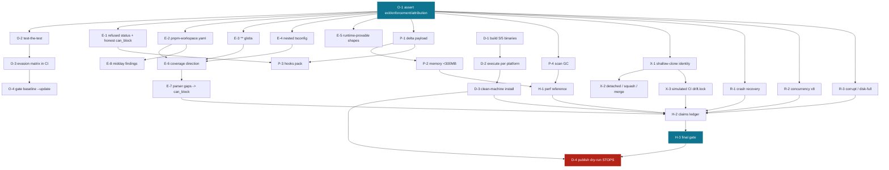
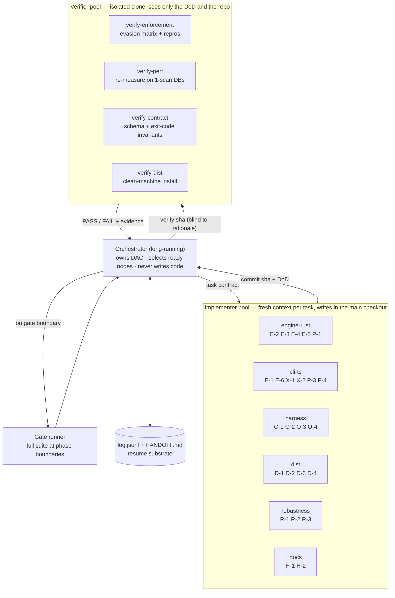

# Drift — Beta Readiness Plan (rev 2)

**Audited:** `e0dc052` (branch `fix/phase-a-correctness`), 2026-07-28
**Method:** isolated clone `~/drift-audit-baseline` built per-commit, private eval-repo copies at
`~/drift-falsification/repos-audit`. Every claim below is a command that ran.
**Target:** a stranger can install Drift, point it at their repo, and get correct, enforced,
trustworthy results — reached by a long-running autonomous agent with no human in the loop.

**Rev 2, 2026-08-02 — independently reviewed and amended.** Spot-checks reproduced: B-5 confirmed
in source (`packages/cli/src/domain/repo-identity.ts:79` runs `rev-list --max-parents=0 HEAD` with
no shallow guard), B-3 confirmed (`core/src/domain.ts:1127`), B-7 re-measured (0/5 in a clean
clone). Amendments: new blocker **B-11** (scan GC) + task **P-4**; decision **D-7** (npm package
identity) pre-registered; **E-7 time box made concrete**; **D-2 DoD** extended (the matrix
validator itself exits 0 saying "Validated" with zero artifacts — a B-4-class defect in the release
tooling); **X-1/D-4 DoD** extended (refusal must cover `drift scan`; partial clones must pass).

**Deploy this file to `docs/beta-run/PLAN.md` when the run starts.** Before seeding `log.jsonl`,
confirm which run owns the main checkout: HEAD of the audit clone (`e0dc052`, the S1-01 commit) is
already past the `a48ac41` run-2 handoff, so something has committed since the handoff — apply the
one-writer rule before starting.

---

## 0. Audit: where the branch actually is

### Verified working (I re-ran each)

| Area | Evidence |
|---|---|
| Fail-closed exit (S1-01) | violation alone exit 2; + adjacent namespace import **exit 3** naming the causing file; clean diff exit 0 (no over-refusal) |
| Baseline semantics (T121) | formbricks: untouched→pass, line rewritten→**BLOCK**, reintroduced→**BLOCK** |
| Portable identity, same-machine (T120) | two checkouts, different paths → identical fingerprint `93def75…`; different remote → differs |
| Prepare latency (T112) | papermark ~12s → **1.8s** warm |
| Gitignore per-directory (T102) | openstatus keeps `injection_caught`; no route swallowing |
| Determinism | 46 invocations, zero variance, stable ordering |
| Precision | type-only decoys and sibling-package lookalikes silent on all repos |

### Broken or missing — the beta blocker set

| # | Blocker | Evidence | Consequence |
|---|---|---|---|
| **B-1** | Recall: relative-path + all re-export shapes bypass on **dub, formbricks, openstatus** | evasion matrix at HEAD | 2 of the 3 block-mode repos can be evaded |
| **B-2** | Resolver: 3 gaps in `crates/drift-engine/src/main.rs` | `read_workspace_packages:1963` reads only `package.json#workspaces`, never `pnpm-workspace.yaml`; glob handling `:1976` only accepts `<prefix>/*` so `packages/**/*` is dropped; `read_js_ts_config_resolution:1831` reads root tsconfig only | root cause of B-1 |
| **B-3** | `can_block` still reported optimistically; `check.status` has no `"refused"` value | `run-check.ts:626`; `CheckRunStatus = "pass"｜"fail"｜"blocked"` (`core/src/domain.ts:1127`) | JSON consumers (MCP, agents, CI) read `status: "pass"` on an exit-3 refusal |
| **B-4** | Oracle never asserts exit code or evidence attribution | S1-01's own commit: suite printed ok for all 7 repos while 4 exit codes changed 0→3 | a green suite proves nothing |
| **B-5** | **Identity breaks on shallow clones** — *found in this audit* | full clone fp `87a2c800…` vs `--depth 1` fp `ab547279…`; `git rev-list --max-parents=0 HEAD` returns the graft, not the root | `actions/checkout` defaults to depth 1, so **CI can never import a developer's `drift.lock`** — invalidates T122/T123 and `docs/ci-integration.md` |
| **B-6** | Check hot path moves 563k records per one-line change | T111 log; formbricks 3.91s, cal.com 6.09s vs <1s | hooks pack (T114) blocked; agent-native claim unsupported |
| **B-7** | **0 of 5 engine binaries verified**; 0/5 exist in a clean clone (measured 2026-08-02) — and `validate-engine-release-matrix.mjs` **exits 0 and prints "Validated 5 engine release targets" with zero artifacts present** unless `--require-artifacts` is passed | `node scripts/validate-engine-release-matrix.mjs` from a clean clone | `npm install -g @drift/cli` in the README **cannot work** for any user; the release tooling's own green output proves nothing (B-4-class) |
| **B-8** | No real repo reaches blocking readiness | parser gaps 15/99/340/502/632/2470 | "blocking gate" is not yet a product claim |
| **B-9** | midday yields 0 findings | evasion matrix, both commits | the whitelist-defeating repo still has no enforcement story |
| **B-10** | Untested: crash/corruption recovery, concurrency >2 writers, git topology | no tests found for `integrity_check`, SIGKILL, shallow/detached/squash | beta users hit all three in week one |
| **B-11** | **No scan GC** — every `drift scan` appends a full fact set; nothing prunes superseded scans | 2026-07-27 bench: ~410MB/run on dub, ~730MB on calcom; 4 runs → 1.6–2.9GB DB | a beta user who scans daily has a multi-GB `.drift` directory inside two weeks — a week-one bad experience nothing else in this plan touches |

B-5 is the newest and the most under-appreciated: the identity work shipped, was verified
same-machine, and is broken in precisely the environment it was built for. B-11 is the quiet one:
it never fails a test, it just makes the product feel broken by week two.

---

## 1. Definition of done — beta gate

Beta opens when all seven gates below are green **in one run, from a clean clone, verified by an
agent that did not implement them**.

```
G0 Oracle       suite fails on a deliberately reverted injection, a demoted enforcement result,
                and a mis-attributed finding
G1 Enforcement  evasion matrix: every should-catch shape caught AND enforced on all block-mode
                repos; negative controls silent; no exit-0-with-demotion path
G2 Coverage     ≥1 real repo reaches can_block unaided; midday produces ≥1 evidenced finding
G3 Hot path     single-file check <1s and <300MB RSS at 5k files on a 1-scan DB; hooks pack ships;
                repeated scans do not grow the DB unboundedly — N scans of an unchanged repo end
                within 1.5× the size of one (P-4)
G4 Portability  identity stable across full/detached/squash checkouts; shallow checkout refused
                with remediation by EVERY identity-deriving command (scan included) before any DB
                is written; partial clone (--filter=blob:none) passes — no over-refusal;
                drift.lock imports in a simulated CI checkout; foreign repo still refused
G5 Distribution 5/5 engine binaries built AND executed on their platform; clean-machine install
                verified per platform; packed artifact blocks a real violation
G6 Robustness   survives SIGKILL mid-scan and mid-check with intact audit chain; 8 concurrent
                checks + MCP with no SQLITE_BUSY; shallow/detached/squash/merge diffs handled
G7 Honesty      every claim in README/docs maps to a test; no number in docs that was not measured
                this run; claims ledger regenerated
```

---

## 2. Work inventory

Lane prefixes: **O** oracle · **E** enforcement · **P** performance · **X** portability ·
**D** distribution · **R** robustness · **H** honesty.

| ID | Task | Deps | Lane |
|---|---|---|---|
| O-1 | Assert `check_exit_code`, `enforcement_matches_mode`, evidence **attribution** in the harness PASS predicate | — | O |
| O-2 | Test-the-test: reverted injection must FAIL the suite | O-1 | O |
| O-3 | Adopt the evasion matrix as a pinned CI suite (12 shapes × 7 repos) | O-1 | O |
| O-4 | Gate baseline `--update` against unsafe field moves (enforcement→none, 2→0, caught→uncaught) | O-1 | O |
| E-1 | `check.status: "refused"` + honest `can_block` derived from what the check did | O-1 | E |
| E-2 | Resolver gap 1: read `pnpm-workspace.yaml` | O-1 | E |
| E-3 | Resolver gap 2: `**` and literal workspace globs; unparseable glob emits a diagnostic | O-1 | E |
| E-4 | Resolver gap 3: nested tsconfig discovery, `paths`/`baseUrl` relative to the **declaring** file | O-1 | E |
| E-5 | Namespace/dynamic/`require` provable at runtime via T12's `collect_identifier_usage` | O-1 | E |
| E-6 | Coverage-direction: freeze to baseline scan; surface block→warn demotion as an explicit event | E-2,E-3,E-4 | E |
| E-7 | Parser-gap burn-down; ≥1 repo reaches `can_block`. **Time box: 3 agent-days from E-6 completion** (or exhaustion of distinct gap classes, whichever first); on expiry, log `BLOCKED`, ship advisory-mode beta per the risk register — do not extend silently | E-2,E-3,E-4 | E |
| E-8 | midday: ≥1 evidenced finding | E-2 | E |
| P-1 | Delta check payload (see decision D-1) | O-1 | P |
| P-2 | Memory ceiling <300MB at 5k files | P-1 | P |
| P-3 | Hooks pack (PreToolUse + pre-commit), gated on <1s measured | P-1,E-1 | P |
| P-4 | Scan GC: prune superseded scans (or reuse scan rows) so N scans of an unchanged repo end ≤1.5× the size of one; verified by measurement (`du` + SQLite page count), not the eval suite | O-1 | P |
| X-1 | Shallow-clone identity: detect and **refuse** with remediation (see D-4). DoD names the seam — `repoIdentityFor` (`repo-identity.ts:97`) — so refusal covers **every** identity-deriving command including `drift scan`, which otherwise writes a wrong-identity DB before any import is attempted. Negative control: partial clone (`--filter=blob:none`) is not shallow and must pass | O-1 | X |
| X-2 | Detached HEAD, squash-merge, merge-commit diff shapes | X-1 | X |
| X-3 | Simulated CI: export `drift.lock` from a full clone, import in a depth-1 detached checkout | X-1 | X |
| D-1 | Build 5/5 engine binaries (see decision D-5) | — | D |
| D-2 | Execute each binary on its platform; matrix validator reports `verified` not `unverified`. **Also fix the validator itself**: it currently exits 0 and prints "Validated" with zero artifacts unless `--require-artifacts` is passed — make missing/unexecuted targets fatal by default in the release path (B-4-class defect in the release tooling) | D-1 | D |
| D-3 | Clean-machine install per platform; packed artifact blocks a real violation | D-2 | D |
| D-4 | Publish dry-run: pack, checksum, provenance, version coherence. **Stops before publish.** | D-3,G0–G6 | D |
| R-1 | SIGKILL ×20 at random offsets mid-scan/mid-check → `PRAGMA integrity_check` + `drift audit verify` + clean recovery | O-1 | R |
| R-2 | 8 concurrent checks + interleaved MCP; no `SQLITE_BUSY` past timeout; latency degradation recorded | O-1 | R |
| R-3 | Corrupt-DB and disk-full handling produce classified errors, not raw SQLite strings | O-1 | R |
| H-1 | Regenerate performance reference from this run's measurements only | P-1,P-2 | H |
| H-2 | README install path matches reality; claims ledger regenerated; every claim maps to a test | all | H |
| H-3 | Final gate run + closing report | all | H |

Deferred, explicitly **not** beta blockers: MCP packet trimming (T130), auth-dominance (T131),
DriftError migration remainder (T132), version single-sourcing (T133), cli.test split (T134),
exact forbidden sets (T135), MCP SDK migration (T137). Each is real; none blocks a user.

---

## 3. Dependency graph



**Critical path:** `O-1 → E-2/E-3/E-4 → E-6 → E-7 → H-2 → H-3`. Everything else has slack.
**O-1 blocks everything** by design: no implementation lands against a suite that cannot fail.
**D-1 has no dependency** — start it on day one; it is wall-clock bound, not logic bound.
**R-lane slack (rev 2):** R-1/R-2/R-3 build new harnesses; they do not consume the external-eval
PASS predicate. Their O-1 dependency is discipline, not logic — if agent capacity allows, the R
lane may start at hour zero alongside D-1 without weakening G0.

---

## 4. Agent topology

The single most important structural decision: **the agent that implements a task never verifies
it.** This codebase's entire defect history — the glob bug surviving 913 tests, the kill-switch
surviving 64 commits, T100's fixtures passing for the wrong reason, my own invalid detection
column — is self-verification failure. Separation is the fix.



**Rules that make this work unattended:**

1. **A task is DONE only when a verifier that did not implement it reproduces its DoD** from a
   separate clone at that commit. Implementer's word is never sufficient.
2. **Verifiers receive the DoD and the commit sha — not the implementer's commit message or
   reasoning.** A verifier told "this fixes X because Y" tends to confirm Y. Mine did not have that,
   which is why it caught the papermark attribution artifact.
3. **Verifier FAIL does not auto-revert.** It reopens the node with the failure evidence attached
   and the implementer gets one more attempt with that evidence; a second FAIL escalates to
   `BLOCKED` in the log and the orchestrator moves to the next ready node. No thrash loops.
4. **One writer per checkout.** Implementers serialize on the main checkout; verifiers work only in
   `~/drift-audit-baseline`-style clones. This cost two invalidated runs during this audit.
5. **Every node writes `log.jsonl` before and after.** Context exhaustion is survivable only if the
   next agent can reconstruct state from disk — this is how run 1 and run 2 both resumed cleanly.
6. **Parallelism = independent lanes only.** O, D, R lanes run concurrently with E once O-1 lands.
   E-2/E-3/E-4 are three separate commits and can be three parallel agents; E-6 waits for all three.

### Task contract (the unit the orchestrator dispatches)

```yaml
id: E-2
lane: engine-rust
goal: read pnpm-workspace.yaml in read_workspace_packages
seam: crates/drift-engine/src/main.rs:1963
red_first:                       # test that must fail before the change
  - test/fixtures/resolve-pnpm-workspace/  # asserts IMPORT_RESOLVES_TO_MODULE edge exists
dod:
  - fixture edge assertion passes
  - formbricks resolved-import count for the forbidden specifier > 0
  - negative controls unchanged (sibling package, type-only silent)
verify_with: verify-enforcement
tier: T2                          # external suite after, never batched
expected_drift: "formbricks injection_caught false -> true; explain in commit body"
on_block: log BLOCKED with evidence; do not revert other lanes
```

---

## 5. Pre-registered decisions

No human in the loop means every fork must be decided **now**. These are mine; veto before launch.

**D-1 — Delta check payload (unblocks P-1, currently "needs redesign").** Choose design **(a)**:
the engine emits facts for changed files only; the CLI merges against the graph already stored in
SQLite. Rationale: storage is already the source of truth, T112's per-scan memo is the seam, and
T15's engine-version gate already refuses cross-version reuse — which is exactly the staleness
safety property (b) would need to invent. Fallback to full emission when no stored scan exists or
the engine version differs. Design (b) (delta + patch) needs patch semantics the codebase has no
precedent for.

**D-2 — Coverage direction.** Freeze to the baseline scan; do not recompute from a diff that
includes newly-detected violations. Any block→warn transition emits an explicit event. Prevents the
measured pathology where improving recall demotes a repo to warn.

**D-3 — `check.status`.** Add `"refused"`. `check_runs.status` is persisted
(`storage/src/migrations.ts:446`), so if stored-row validation rejects the new value, ship a forward
migration in the T16 style rather than a bare type edit.

**D-4 — Shallow clones.** **Refuse, don't guess.** On `git rev-parse --is-shallow-repository` =
true, identity derivation must fail closed with exit 3 and the remediation string
(`fetch-depth: 0`), because a silently wrong identity is how B-5 stayed invisible. The refusal
lives in `repoIdentityFor` (`packages/cli/src/domain/repo-identity.ts:97`) — the seam every
command shares — not in `contract import`: a shallow `drift scan` that succeeds writes a
wrong-identity DB *before* any import runs, and that is the silent path by which B-5 stayed
invisible. Two boundaries: partial clones (`--filter=blob:none`) are **not** shallow and must pass
(no over-refusal); `docs/ci-integration.md` leads with `fetch-depth: 0` in the same commit.
Optional convenience: attempt `git fetch --unshallow` only when explicitly permitted by a flag;
never implicitly.

**D-5 — Engine binaries.** Authorize installing `cargo-zigbuild` + `zig` locally to cross-compile
the Linux targets, and Docker for the execution check. Windows via zig is unreliable — if it fails
twice, mark `win32-x64` UNSUPPORTED for beta, remove it from `optionalDependencies` rather than
shipping an empty package, and say so in the README. Shipping an empty platform package is worse
than not supporting the platform. *(This reverses the earlier "defer binaries" decision, which was
correct then and is incompatible with beta now: no binaries, no users.)*

**D-6 — The one human gate: `npm publish`.** Everything up to and including a verified, checksummed,
dry-run-published artifact set is automated. The publish itself is not, and I would not automate it
even if asked: it is irreversible, outward-facing, and publishes under your account and name. The
run ends with a single command in `HANDOFF.md` and a report of exactly what would go out. This is
the only place the "no human in the loop" instruction is not honored, and it is deliberate.

**D-7 — npm package identity (rev 2; the D-4 dry-run forks on this without it).** Publish as
**`driftdetect@1.0.0-beta.N`**. Rationale: npm `driftdetect` is still v1 and carries the audience
from the January viral moment (~750 stargazers get the release-notes ping; reddit still sends
~106 uniques/14d); a new scope like `@drift/cli` abandons that and the org scope may not even be
claimable. Consequences the run must enforce: the D-4 version-coherence check validates against
`driftdetect`, the README install command becomes `npm install -g driftdetect` (H-2), and the
platform packages become `driftdetect-engine-<platform>` (or scoped under an org Geoffrey
actually owns — verify claimability during D-1, escalate in `HANDOFF.md` if not). **This is the
decision most worth a veto** — it publishes over the v1 audience rather than beside it.

---

## 6. Execution protocol

**Verification tiers** (inherited from run 2, with one addition):

| Tier | When | Command |
|---|---|---|
| T0 | after every edit | `pnpm build` + the touched package's vitest file |
| T1 | before every commit | `pnpm test:engine && pnpm -r test` |
| T1e | commits touching CLI/MCP surfaces, exit codes, or `scripts/` | T1 + `pnpm test:e2e` |
| T2 | after every task | `pnpm eval:external` — **never batched** for matcher/resolver/enforcement changes |
| T3 | at every gate | `pnpm verify:ci` + the evasion matrix from an isolated clone |

**Halt conditions** (log and move on; never improvise):
premise false · T2 regression unexplained by the current task · a dependency not pre-authorized in
§5 · anything outward-facing · disk below 5 GB · two consecutive DoD failures in the same lane.

**Context exhaustion:** write `HANDOFF.md` with tree state, next ready node, and the reason; the
next agent resumes from `log.jsonl`. Both prior runs did this successfully — keep the format.

**Anti-patterns, each of which has already cost this project time:**
fixture-green as proof (T22, my rev-1 detection column) · counting findings without checking
attribution (papermark barrels) · measuring against a stale release binary (T-stale-binary) ·
writing a number you did not measure (T42) · two writers in one checkout (this audit, twice) ·
`--update` as a rubber stamp · **reclassifying a defect as a test artifact without a test that
isolates the product from the artifact** (T101 — the reclassification generalized from "the harness
manufactured this instance" to "the behaviour is correct"; those are different claims).

---

## 7. Risk register

| Risk | Likelihood | Mitigation |
|---|---|---|
| E-2/E-3/E-4 resolve *more* and the matcher over-matches | high | negative controls are an acceptance gate on every resolver commit, not a follow-up |
| Recall fixes trip more repos into warn | high | D-2 decided up front; E-6 sequenced immediately after |
| P-1 leaves the check path half-migrated | medium | single agent, single lane, fallback-to-full-emission path lands first |
| Windows binary unbuildable | medium | D-5: drop the platform rather than ship an empty package |
| Parser gaps don't fall enough for any repo to block | medium | E-7 time box is concrete (3 agent-days from E-6, see inventory); on expiry beta ships as *advisory* with the claim ledger updated — that is honest and still useful |
| DB growth makes the product feel broken by week two | high without P-4 | B-11/P-4: scan GC is now in the inventory and gated in G3 |
| Release tooling reports green with nothing built | demonstrated | D-2 makes missing/unexecuted targets fatal by default in the validator |
| An agent marks its own work done | low, catastrophic | verifier pool is structural, not advisory |

---

## 8. What to do first

1. **Confirm checkout ownership** — HEAD (`e0dc052`) is past the run-2 handoff commit; establish
   which run owns the main checkout before this one writes anything (one-writer rule).
2. Copy this file to `docs/beta-run/PLAN.md`; seed `log.jsonl`; reuse run 2's `PROTOCOL.md`.
3. Start **D-1** (binaries) immediately — it is wall-clock bound and blocks nothing else. Verify
   npm name claimability for D-7 while there.
4. Start **O-1** — the E, P, and X lanes wait on it. The R lane may also start now (see §3,
   R-lane slack) if agent capacity allows.
5. Everything else follows the DAG.

Expected shape: O, D, and optionally R lanes in parallel from hour zero; E lane the long pole at
roughly a week; P-1 the largest single engineering item; X lane short. The honest estimate is
**2–3 weeks of agent-time to G0–G7**, with E-7 (parser gaps) the item most likely to hit its
3-agent-day box and the one most safely descoped by shipping advisory-mode beta.
